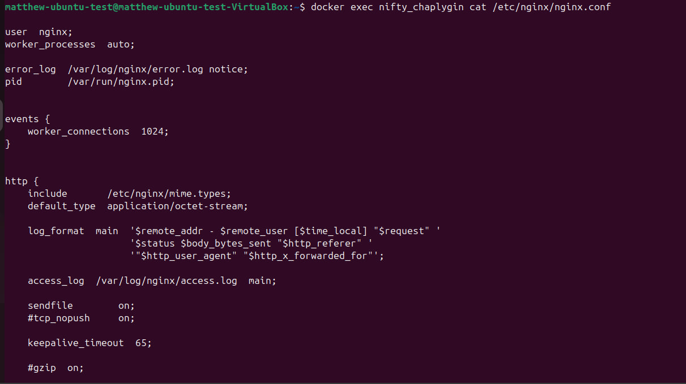

## Докер

# PART 1
Взять официальный докер образ с nginx и выкачать его при помощи docker pull:

Проверить наличие докер образа через docker images:

Запустить докер образ через docker run -d:
Проверить, что образ запустился через docker ps:

Посмотреть информацию о контейнере через docker inspect (Размер контейнера, Список замапленых портов, Ip контейнера, )

Остановить докер образ через docker stop:
Проверить, что образ остановился через docker ps:

Запустить докер с замапленными портами 80 и 443 на локальную машину через команду run:

Проверить, что в браузере по адресу localhost:80 доступна стартовая страница nginx:

Запускаем заново докер образ, Проверить любым способом, что контейнер запустился:

# PART 2
Прочитать конфигурационный файл nginx.conf внутри докер образа через команду exec:

Создать на локальной машине файл nginx.conf. Настроить в нем по пути /status отдачу страницы статуса сервера nginx:

Скопировать созданный файл nginx.conf внутрь докер образа через команду docker cp:

Прочитать конфигурационный файл nginx.conf внутри докер образа через команду exec:

Перезапустить nginx внутри докер образа через команду exec:

Остановить контейнер:

Удалить образ через docker rmi, не удаляя перед этим контейнеры:

Импортировать контейнер обратно через команду import:

Запустить импортированный контейнер:

